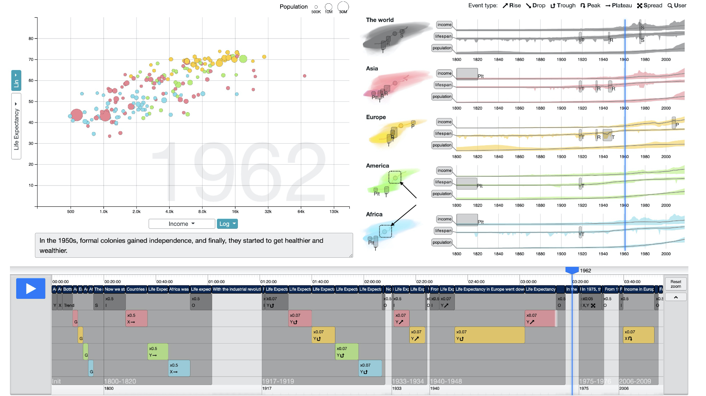

### Roslingifier: Semi-Automated Storytelling for Animated Scatterplots



We present Roslingifier, a data-driven storytelling method for animated scatterplots. Like its namesake, Hans Rosling (1948–2017), a professor of public health and a spellbinding public speaker, Roslingifier turns a sequence of entities changing over time—such as countries and continents with their demographic data—into an engaging narrative telling the story of the data. This data-driven storytelling method with an in-person presenter is a new genre of storytelling technique and has never been studied before. In this paper, we aim to define a design space for this new genre—data presentation—and provide a semi-automated authoring tool for helping presenters create quality presentations. From an in-depth analysis of video clips of presentations using interactive visualizations, we derive three specific techniques to achieve this: natural language narratives, visual effects that highlight events, and temporal branching that changes playback time of the animation. Our implementation of the Roslingifier method is capable of identifying and clustering significant movements, automatically generating visual highlighting and a narrative for playback, and enabling the user to customize. From two user studies, we show that Roslingifier allows users to effectively create engaging data stories and the system features help both presenters and viewers find diverse insights.


### Citation Information

Minjeong Shin, Joohee Kim, Yunha Han, Lexing Xie, Mitchell Whitelaw, Bum Chul Kwon, Sungahn Ko, Niklas Elmqvist (2022). [Roslingifier: Semi-Automated Storytelling for Animated Scatterplots.](https://ieeexplore.ieee.org/stamp/stamp.jsp?tp=&arnumber=9695173) IEEE Transactions on Visualization and Computer Graphics.


### Getting Started

Instructions on how to set up the local development.
This app is built on python 3.7.

```
# Clone the repo
git clone git@github.com:shinminjeong/Roslingifier.git

# Go to the project directory
cd Roslingifier

# Install packages
pip install -r requirements.txt

# Run webapp
./run.sh
```

and access the frontend at [http://localhost:8000/](http://localhost:8000/)


### How to Use Roslingifier

[](https://youtu.be/BTkwk00gU0g)
